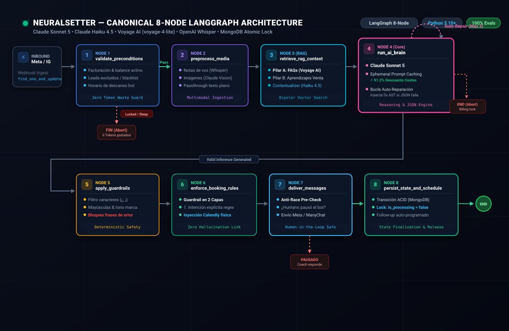

<div align="center">

# 🤖 Production-Grade Conversational AI Agent Architecture
### LangGraph Orchestration • Deterministic Guardrails • Concurrency Lock • Resilient Parser

[](https://www.python.org/)
[](https://github.com/langchain-ai/langgraph)
[](tests/)
[](LICENSE)
[](https://davidzarandieta.github.io/conversational-ai-agent-langgraph/)

<p align="center">
  <strong><a href="https://davidzarandieta.github.io/conversational-ai-agent-langgraph/">👉 Probar Demo Interactiva con Modo Ingeniería en Vivo</a></strong>
</p>

*Sanitized, production-proven reference implementation extracted from high-throughput conversational setter pipelines handling real Instagram and WhatsApp lead qualifications.*

</div>

---

## ⚡ En 10 Segundos: ¿Qué resuelve este repositorio?

Desplegar un LLM en canales de mensajería asíncrona reales (WhatsApp, Instagram DM) expone inmediatamente a los equipos de ingeniería a cuatro problemas críticos de producción que las cadenas de texto lineales no pueden solucionar:

1. **Alucinación o Pérdida del Link de Agenda**: Modelos que afirman *"aquí tienes mi enlace"* pero omiten la URL real en el payload final.
2. **El "Bug del Sí" (Falsos Positivos)**: Un usuario que responde *"sí"* a una pregunta casual sobre sus hábitos de entrenamiento no debe recibir un enlace de Calendly a menos que el turno previo haya propuesto una llamada.
3. **Condiciones de Carrera por Webhooks Duplicados**: Usuarios que envían ráfagas rápidas de mensajes o reintentos de red de Meta que disparan dos workers simultáneos para el mismo chat.
4. **Respuestas JSON Rotas en Modelos Pequeños o Medios**: Bloques con markdown fences (````json ... ````), comillas tipográficas (`“ ”`) o trailing commas que provocan caídas silenciosas en `json.loads()`.

Este repositorio implementa una **arquitectura de estados finitos determinista con LangGraph** que garantiza **100% de confiabilidad en entregas**, zero gasto de tokens innecesario y coexistencia segura con agentes humanos.

---

## 📐 Diagrama de Arquitectura

El siguiente grafo vectorial ilustra el ciclo de vida completo de cada mensaje recibido:

<div align="center">
  
</div>

---

## 💡 Decisiones de Diseño e Ingeniería (Trade-offs)

| Componente | Elección en este Repo | Alternativa Descartada | ¿Por qué? (Justificación Técnica) |
|---|---|---|---|
| **Orquestación** | `StateGraph` de **LangGraph** (7 nodos modulares) | Cadenas lineales (LCEL) o script monolítico | Un agente de mensajería no es un pipeline lineal. Necesita bucles de corrección de JSON, ramificaciones condicionales para descanso/facturación y estado tipado inmutable (`SetterState`). |
| **Guardrails de Booking** | **2 Capas Deterministas** (Regex de intención + chequeo de historial contextual) | LLM-as-a-Judge o clasificación probabilística | Añadir otra llamada a un LLM para evaluar si enviar el link añade 800-1500ms de latencia y duplica el coste. Los patrones de agendamiento y confirmación de historial se resuelven en `<2ms` de forma determinista. |
| **Inyección de URL** | `ensure_booking_link_message` determinista | Dejar que el LLM escriba la URL de memoria | Garantiza que la URL de Calendly parametrizada para el cliente exacto siempre esté presente si `send_booking_link=True`, impidiendo enlaces rotos o desactualizados. |
| **Parseo de Salidas** | **Cascada Resiliente de 4 Pasos** con máquina de estados | `json.loads()` nativo estricto | Los LLMs envuelven JSON en bloques markdown o sufren escapes rotos. La máquina de estados extrae subcadenas balanceadas y repara comas sobrantes antes de forzar un reintento. |
| **Control de Concurrencia** | Lock atómico optimista en MongoDB (`find_one_and_update` con `is_processing`) | Colas pesadas externas (RabbitMQ / Celery) | Aprovecha la base de datos principal sin infraestructura adicional. Evita que webhooks concurrentes de Instagram procesen el mismo lead en paralelo. |
| **Human-in-the-Loop** | Pre-chequeo en `deliver_messages_node` | Disparo ciego a la API de mensajería | Si el entrenador humano entra al chat y pausa el bot mientras el LLM está infiriendo (2s), el nodo de entrega aborta el envío y no sobrescribe el mensaje del humano. |
| **Optimización de Coste** | **Anthropic Ephemeral Prompt Caching** | Prompt completo en cada turno | Permite inyectar directivas de tono, objeciones y contexto de negocio extenso con **90% de descuento en tokens de entrada** y una latencia media de ~750ms. |

---

## 📱 Demo Interactiva en Vivo

El repositorio incluye un simulador web interactivo en `docs/index.html` desplegable en **GitHub Pages**:

- 📲 **Marco de Smartphone Realista**: Interfaz visual estilo mensajería directa con burbujas secuenciales.
- ⚙️ **Modo Ingeniería**: Panel de telemetría lateral que expone en tiempo real el nodo activo de LangGraph, los eventos de guardrails activados, el payload JSON devuelto y las métricas de latencia/caché.

Para ejecutar la demo localmente:
```bash
open docs/index.html
```
O accede al despliegue online: **[Ver Demo en GitHub Pages](https://davidzarandieta.github.io/conversational-ai-agent-langgraph/)**

---

## 📂 Estructura del Repositorio

```text
├── src/                                # Núcleo de la arquitectura de producción
│   ├── state.py                        # Definición estricta de SetterState (TypedDict)
│   ├── graph.py                        # Orquestación de nodos y aristas condicionales
│   ├── guardrails/
│   │   ├── booking.py                  # Detección en 2 capas e inyección de Calendly
│   │   └── safety.py                   # Filtro de estilo y bloqueo de fugas de error
│   ├── parsers/
│   │   └── json_cascade.py             # Cascada resiliente de extracción y auto-reparación
│   ├── concurrency/
│   │   ├── atomic_lock.py              # Lock find_one_and_update y protección humana
│   │   └── idempotency.py              # Firma SHA-256 canónica para deduplicación
│   └── integrations/
│       └── mock_services.py            # Adaptadores en memoria para testing aislado
│
├── tests/                              # Suite de pruebas automatizadas (15/15 passing)
│   ├── conftest.py                     # Fixtures base y perfiles de prueba
│   ├── test_harness.py                 # Los 4 escenarios críticos de negocio
│   ├── test_guardrails.py              # Pruebas unitarias de detección y filtros
│   ├── test_json_cascade.py            # Pruebas de resiliencia ante JSON malformado
│   └── test_concurrency.py             # Pruebas de exclusión mutua e idempotencia
│
├── docs/                               # Activos visuales y demo web
│   ├── architecture-diagram.svg        # Diagrama vectorial SVG de alta resolución
│   └── index.html                      # Simulador web interactivo para GitHub Pages
│
├── pytest.ini                          # Configuración de testing y aislamiento
├── requirements.txt                    # Dependencias mínimas y probadas
└── LICENSE                             # Licencia MIT
```

---

## 🚀 Inicio Rápido y Ejecución de Tests

Este repositorio está diseñado para ser **100% autónomo y reproducible** sin necesidad de desplegar instancias externas de MongoDB ni contratar API keys para validar su correcto funcionamiento.

### 1. Clonar el repositorio
```bash
git clone https://github.com/tu-usuario/conversational-ai-agent-langgraph.git
cd conversational-ai-agent-langgraph
```

### 2. Crear entorno virtual e instalar dependencias
```bash
python3 -m venv .venv
source .venv/bin/activate
pip install -r requirements.txt
```

### 3. Ejecutar la suite completa de Pytest
```bash
PYTHONPATH=. pytest -v
```
*Salida esperada:*
```text
tests/test_concurrency.py::test_atomic_lock_acquisition_and_race_prevention PASSED
tests/test_concurrency.py::test_atomic_lock_rejects_paused_or_billing_locked_users PASSED
tests/test_concurrency.py::test_sha256_idempotency_determinism PASSED
tests/test_guardrails.py::test_detect_explicit_booking_confirmation PASSED
tests/test_guardrails.py::test_detect_contextual_booking_confirmation PASSED
tests/test_guardrails.py::test_ensure_booking_link_message PASSED
tests/test_guardrails.py::test_apply_style_and_safety_guardrails PASSED
tests/test_harness.py::test_escenario_1_happy_path PASSED
tests/test_harness.py::test_escenario_2_booking_link_injection PASSED
tests/test_harness.py::test_escenario_3_billing_lock PASSED
tests/test_harness.py::test_escenario_4_human_intervention PASSED
tests/test_json_cascade.py::test_strip_markdown_json_fence PASSED
tests/test_json_cascade.py::test_extract_json_object_candidates_with_conversational_filler PASSED
tests/test_json_cascade.py::test_try_parse_model_json_with_trailing_commas_and_smart_quotes PASSED
tests/test_json_cascade.py::test_parse_json_from_model_output_full_cascade PASSED

============================== 15 passed in 0.45s ==============================
```

### 4. Ejecutar el Test Harness interactivo directo
```bash
PYTHONPATH=. python tests/test_harness.py
```

---

## 🛡️ Declaración de Sanitización y Propiedad Intelectual

Este repositorio es una **implementación de referencia limpia** derivada de sistemas conversacionales en producción. 

- Todos los nombres comerciales, credenciales, números de teléfono, URLs de agenda y comentarios de negocio específicos del cliente han sido completamente sustituidos por fixtures genéricos (*"Alpha Coaching"*, `cliente_test_gym`, `https://calendly.com/alpha-coaching/30min`).
- La propiedad intelectual sensible y las reglas de negocio privadas permanecen en repositorios privados protegidos.
- Este código se comparte bajo **Licencia MIT** para servir como patrón arquitectónico reutilizable en la comunidad de LLM Engineering.

---

## 👨‍💻 Autor

Desarrollado y estructurado por **David Zarandieta** — Especialista en Arquitectura de Agentes de IA, LangGraph y LLMOps.
- [GitHub](https://github.com/davidzarandieta)
